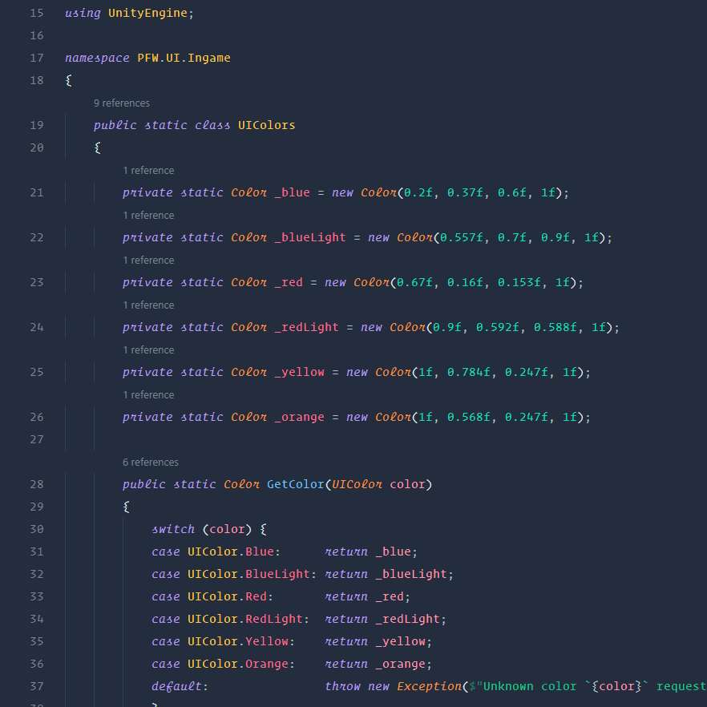

# Summer Vacation Theme
A vivid palette that's bright and colorful without being overbearing.

## About
I've been using this theme for years in VS Code (and even used its color palette as the basis for my [website design](https://dannymcgee.io)), tweaking and modifying bits and pieces along the way, and finally decided that it's ready to be published.

It features a color palette that spans the full rainbow spectrum to allow for extremely granular syntax highlighting.

It also features extensive use of *italics* for extra differentiation of tokens such as keywords, `this`, comments, and HTML attributes. This was done primarily with [Operator Mono](https://www.typography.com/fonts/operator/styles/operatormonoscreensmart) in mind, but it should work nicely with any font family that includes an italicized style (including the VS Code defaults, Consolas and Courier-New).

## Alternate Schemes

In addition to the default 'Dark' scheme (light version coming soon!), also included are two alternate schemes which mimic the syntax colors of VS Code's default Dark theme and Atom One Dark. While I personally think that the Summer Vacation default provides the best experience (I may be biased), if you're migrating from one of these other popular themes, using the corresponding alternate may make it a bit easier to get accustomed to the new color palette.

## Tokens

While the theme has been optimized for web development, most of the syntax tokens have been defined generically enough to *likely* work well with a wide variety of languages. If you find a language that looks like crap or would benefit from more specific tokenization, feel free to [open an issue](https://github.com/dannymcgee/vscode-summer-vacation-theme/issues).

## Screenshots
> **Important Note:** Many of these screenshots make use of custom extended grammars for some syntax highlighting features. These extensions aren't necessary — the theme will work fine without them — but your results may vary a little (or a lot) from the screenshots below unless you install them.
>
> * [SCSS Grammar Extended](https://marketplace.visualstudio.com/items?itemName=dannymcgee.scss-grammar-extended)
> * [TypeScript Grammar Extended](https://marketplace.visualstudio.com/items?itemName=dannymcgee.ts-grammar-extended)
> * [Angular HTML Syntax](https://marketplace.visualstudio.com/items?itemName=dannymcgee.ng-html)

### HTML

### CSS

### SCSS

### JavaScript (vanilla)

### React

### TypeScript (Angular)

### Angular HTML

### C#

### UI
[View full size](examples/img/ui.png)

