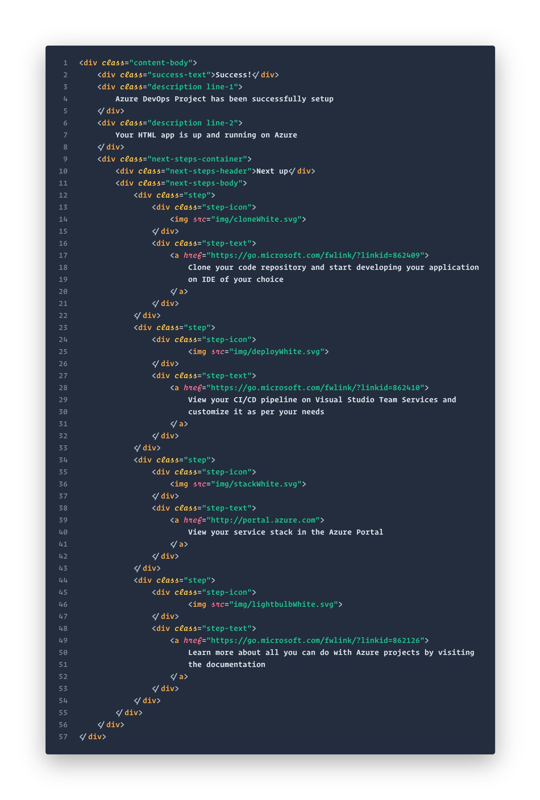
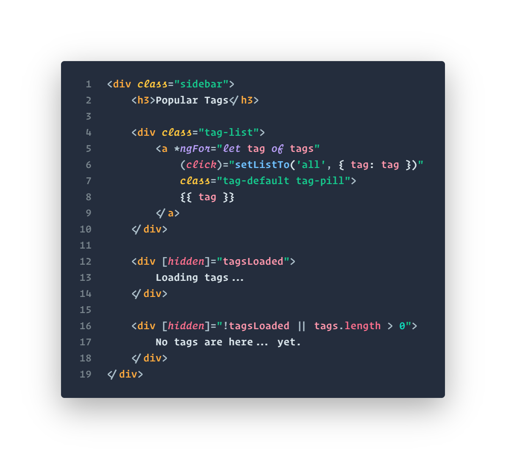

# Summer Vacation Theme
A vivid palette that's bright and colorful without being overbearing.

## About
Summer Vacation features a playful color palette that spans the full rainbow spectrum.

While colors have been carefully selected for visual compatibility, Summer Vacation's philosophy is to prioritize _informative syntax highlighting_ over aesthetics.

An interesting consequence of this is that you can get a high-level feel for the character of a language by observing which colors are more prominent in the syntax. Dynamic and highly functional languages often resemble swirls of cotton candy, while statically typed and object-oriented languages look more like sunset on a Pacific beach boardwalk &mdash; liberally accented with golden yellows and oranges.

## Alternate Schemes
In addition to the default Dark and Light schemes, also included are two alternate schemes which shuffle the palette around to mimic the syntax colors of VS Code Dark+ and Atom One Dark. If you're migrating from one of these other popular themes, using the corresponding alternate may make it a bit easier to get accustomed to Summer Vacation's palette.

## UI Theme
Beyond syntax, the UI has been designed with legibility in mind, with most UI elements meeting at least WCAG AA standards for contrast.

## More Code Samples
### HTML

### SCSS

### JSX

### TypeScript (Angular)

### Angular HTML

### C#

