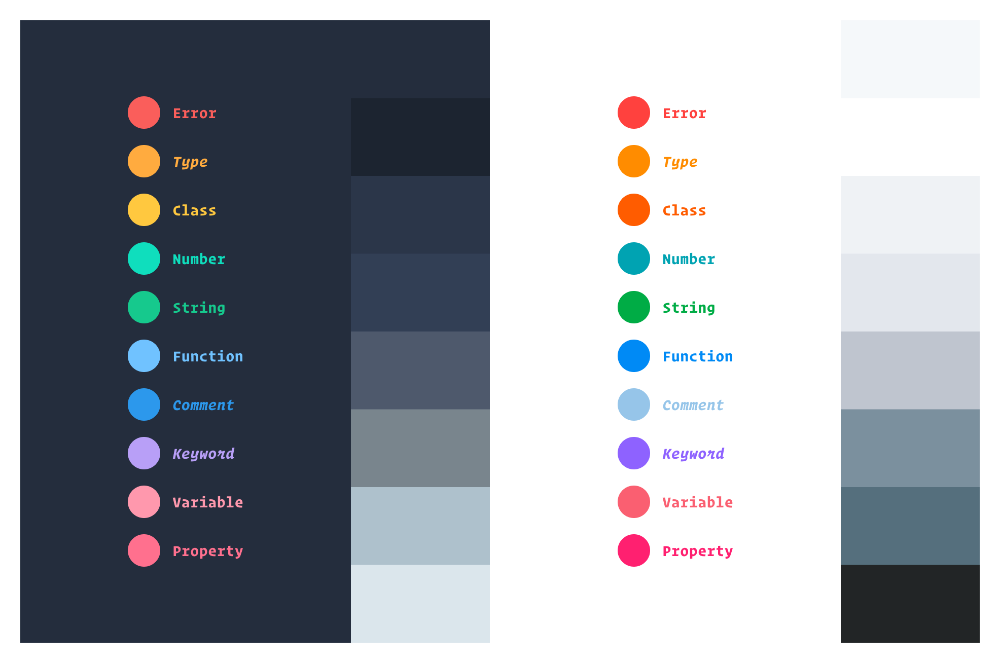
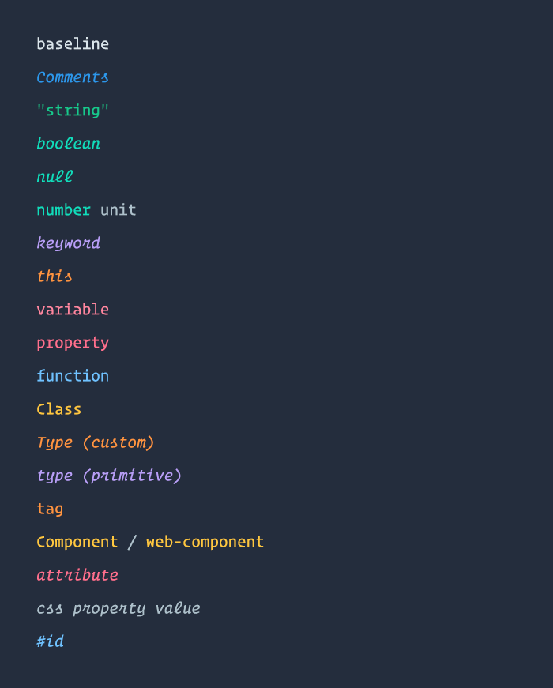
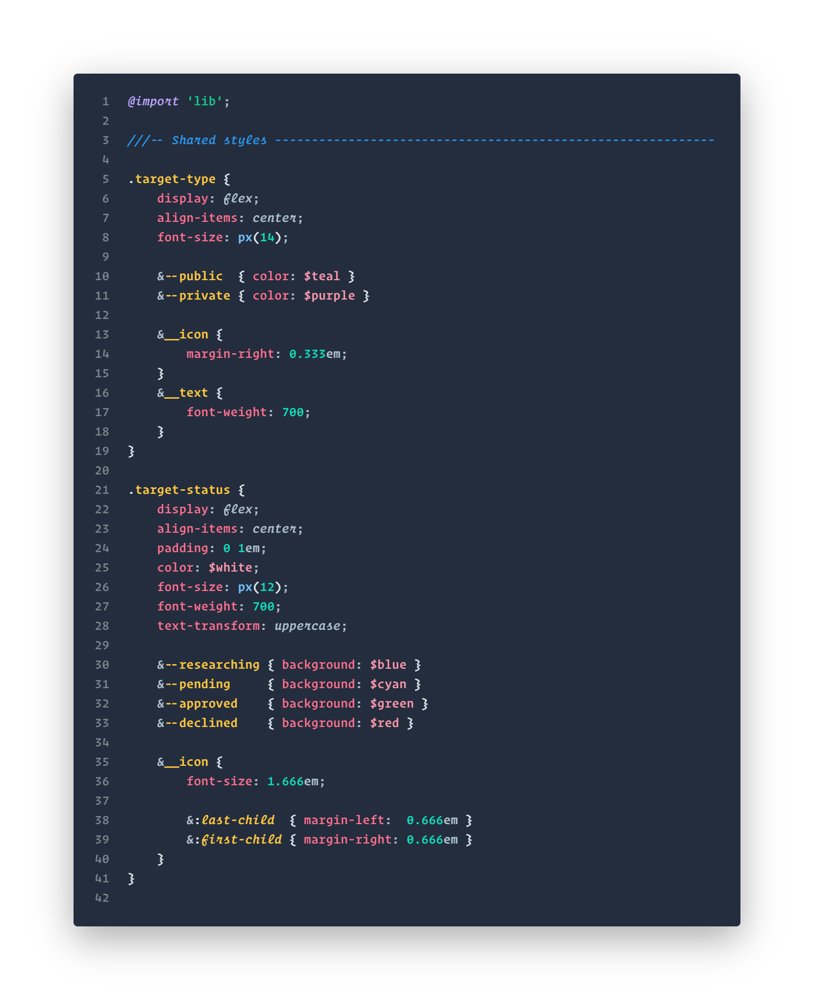

# Summer Vacation Theme
A vivid palette that's bright and colorful without being overbearing.

## About
I've been using this theme for years in VS Code (and even used its color palette as the basis for my [website design](https://dannymcgee.io)), tweaking and modifying bits and pieces along the way, and finally decided that it's ready to be published.

It features a color palette that spans the full rainbow spectrum to allow for extremely granular syntax highlighting.

It also features extensive use of *italics* for extra differentiation of tokens such as keywords, `this`, comments, and HTML attributes. This was done primarily with [Operator Mono](https://www.typography.com/fonts/operator/styles/operatormonoscreensmart) in mind, but it should work nicely with any font family that includes an italicized style (including the VS Code defaults, Consolas and Courier-New).

## Tokens

While the theme has been optimized for web development, most of the syntax tokens have been defined generically enough to *likely* work well with a wide variety of languages. If you find a language that looks like crap or would benefit from more specific tokenization, feel free to [open an issue](https://github.com/dannymcgee/vscode-summer-vacation-theme/issues).

## Screenshots
> **Important Note:** Many of these screenshots make use of custom grammars for syntax highlighting which I hope to release soon. Once they're released, this readme will be updated with the relevant links.

### HTML

### CSS

### SCSS

### JavaScript (vanilla)

### React

### TypeScript (Angular)

### Angular HTML
[Custom grammar extension](https://marketplace.visualstudio.com/items?itemName=dannymcgee.ng-html)

### UI
[View full size](examples/img/ui.png)

